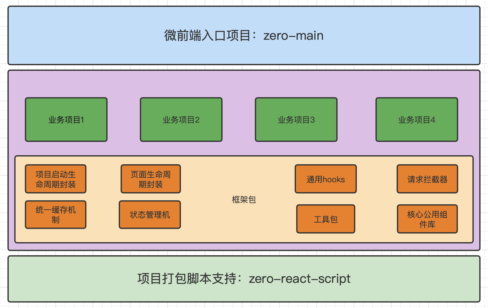

# 中台建设

关于中台建设技术设计想法浅谈；
中台的建设一直是一个比较容易忽视但是又比较重要的项目；比较容易忽视则是没有直接的产出，大部分公司则是能买则买，能凑合则凑合，因为即便没有中台，app 和小程序等 toC 的项目
照样能运行。但随着业务越来越多，对 toC 的灵活程度要求越来越高，对于中台才慢慢重视起来，但中台涉及业务繁杂，没有统一的业务设计则很容易失控，从技术角度触发尽量避免一些麻烦是很必要的,
对于中台常见的问题，比如业务模块多，项目使用技术栈不统一、公用逻辑各个业务项目各自为政，重复逻辑不统一，一旦调整容易遗漏等等问题，做了以下设计，让中台即便是面临大的重构也不会无从下手

整体设计思路如下：


根据以上设计做如下项目，拉取代码安装依赖包，则可以直接使用

- [业务项目](https://github.com/jason-gkq/zero-react-pc)
- [核心框架包](https://github.com/jason-gkq/zero-pc)
- [打包脚本](https://github.com/jason-gkq/zero-react-script)

### 介绍

此项目为乾坤框架为基础的中台入口项目，根据配置文件可以加载对应挂载的子项目；

### 使用说明

env 为各个环境配置文件

- local 开发
- uat 测试
- pre 堡垒
- prod 生产

项目安装依赖包

```sh
yarn
```

本地开发

```sh
yarn start
```

打包

```sh
yarn build:uat
yarn build:pre
yarn build:prod
```
